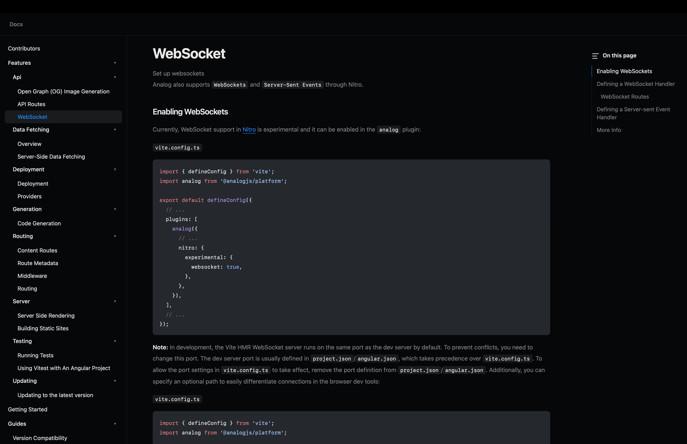

Most documentation sites share the same skeleton: a sidebar built from your file structure, a content area that renders some Markdown, a table of contents that tracks what you're reading, and a layout that works on mobile. This is so common, that there are various libraries out there for React that provide all of this out of the box. The React ecosystem has [Fumadocs](https://www.fumadocs.dev/), [Docusaurus](https://docusaurus.io/), and even [Nextra](https://nextra.site/). The Vue/Vite community has [VitePress](https://vitepress.dev/). Sadly, there's nothing out there for the Angular community. So I wanted to build that.



I've been building a new library for [AnalogJS](https://analogjs.org). Right now the temporary name is `ng-docs`, but I'm working on formalizing this and working with another contributor on that.

## How This Works

Let's start off with a base of using Analog and it's filesystem router. 

```txt
analog/
├── src/
│   ├── app/
│   │   └── ...
│   ├── content  /
│   │   └── docs  /
│   │       ├── features/
│   │       ├── guides/  
│   │       ├── integrations/  
│   │       ├── packages/  
│   │       ├── contributors.md  
│   │       ├── getting-started.md  
│   │       ├── introduction.md  
│   │       ├── sponsoring.md  
│   │       └── support.md  
│   ├── server/  
│   ├── main.server.ts  
│   └── main.ts  
├── index.html  
└── vite.config.ts
```

For my experiments, I've been assuming the following: 
- Mostly working in Markdown
- There could be deeply nested folders with files
- Mostly content driven, little interaction (for now)

Since this was a brand new setup, I limited the scope to keep focus.

For all of these assumptions, Analog works great, expect for the second point, deeply nested routes.

Analog has supported deeply nested content routes before, but on the application side, you needed to explicitly setup the pages for that content, which wasn't ideal. Meaning, in our docs content: 

```
docs  /
└── features/
    └── some-folder/
        └── some-nested-folder/
            └── another/
```

For all of these folders, we'd need to setup pages for each of them. If your content isn't setup this way, then you wouldn't run into this issue. But in my past projects, documentation is never that concise. Frameworks like Next though support this type of setup easily with a convent called optional catch all routes. That's that `[[...slug]]` syntax that allows the component that catch any route, no matter how nested it gets. I wanted this to be something supported in Analog, so I went and sent a [PR over to do this](https://github.com/analogjs/analog/pull/2043). Now, no matter how nested your docs content gets, you can use the same syntax to support it.

```
src/
└── app  /
    └── pages  /
        └── docs  /
            └── [[...slug]].page.ts  
```

With this bit of a preamble done, let's look at how the docs get setup.


## What's in a library

`ng-docs` is made up of a few pieces:

- **`DocsProvider`** — A discovers Markdown files via Analog's `injectContentFiles`, builds a slug-based registry, and constructs a hierarchical navigation tree from your folder structure
- **`DocsLayout`** — The main layout with a header, collapsible sidebar navigation, mobile responsive overlay
- **`DocsPage`** — The content area with a right-side TOC panel and a collapsed mobile TOC dropdown
- **`DocsTitle`** / **`DocsDescription`** — A simple presentational components for frontmatter fields

And that's it! There's a bit more under the hood, but for public facing APIs, everything get's built off of already existing APIs that are part of Analog.

## How it works under the hood

### Content discovery

You first configure a docs source with a `withDocumentationSource()` provider. Once initialized, it take the `dir` and `baseUrl` and construct a dictionary of all of the content that is available. 

```ts
export const appConfig: ApplicationConfig = {
  providers: [
    // ... along with any other providers
    provideContent(
      withMarkdownRenderer(),
      withDocumentationSource<DocsAttributes>({
        dir: 'src/content/docs',
        baseUrl: '/docs',
      }),
    ),
  ],
};
```


Additionally, it will derive a slug for each document based on the file path.

```
src/content/docs/features/routing/overview.md  →  slug: "features/routing/overview"
src/content/docs/getting-started.md            →  slug: "getting-started"
src/content/docs/integrations/nx/index.md      →  slug: "integrations/nx"
```

The provider then walks each slug's segments and builds a tree of `NavItem` objects (folders or pages) that the sidebar renders recursively.

### Create the layout route

Using Analogs conventions for file-based routing, create a `src/app/pages/docs.page.ts` as the main layout:

```ts
import { Component, inject } from '@angular/core';
import { RouterOutlet } from '@angular/router';
import { DocsLayout, DocsProvider } from '@ng-docs/ng-docs';

@Component({
  selector: 'app-docs-index-page',
  standalone: true,
  imports: [RouterOutlet, DocsLayout],
  template: `
    <ng-docs-layout [navItems]="navItems">
      <router-outlet />
    </ng-docs-layout>
  `,
})
export default class DocsIndexPageComponent {
  private docsProvider = inject(DocsProvider);
  navItems = this.docsProvider.pageTree;
}
```

This wraps all child routes in the docs shell with the sidebar navigation.

### Create the catch-all content route

Create `src/app/pages/docs/[[...slug]].page.ts` to handle any docs path:

```ts
import { Component, computed, inject } from '@angular/core';
import { ActivatedRoute } from '@angular/router';
import { toSignal } from '@angular/core/rxjs-interop';
import {
  Doc,
  DocsPage,
  DocsProvider,
  DocsTitle,
  DocsDescription,
} from '@ng-docs/ng-docs';
import { MarkdownComponent } from '@analogjs/content';

@Component({
  selector: 'app-docs-slug-page',
  standalone: true,
  template: `
    @let page = source.value();
    @if (page) {
      <ng-docs-page [page]="page" [toc]="page.toc ?? []">
        <ng-docs-title [title]="page.attributes.title" />
        <ng-docs-description [description]="page.attributes.description ?? ''" />
        <analog-markdown class="prose-docs max-w-none" [content]="page.content" />
      </ng-docs-page>
    }
  `,
  imports: [DocsPage, DocsTitle, DocsDescription, MarkdownComponent],
})
export default class DocsSlugPageComponent {
  private docsProvider = inject(DocsProvider);
  private route = inject(ActivatedRoute);
  private paramMap = toSignal(this.route.paramMap, {
    initialValue: this.route.snapshot.paramMap,
  });
  readonly slug = computed(() => this.paramMap()?.get('slug') ?? '');
  readonly source = this.docsProvider.getPage<Doc>(this.slug);
}
```

The `getPage()` method resolves the slug to a content file path and uses Analog's `contentFileResource` to load and render it. The rendered HTML and TOC come back as signals.

### Write some docs

Drop Markdown files into `src/content/docs/`:

````markdown
---
title: "Getting Started"
description: "Learn how to set up your project"
---

## Installation

Run the following command:

```bash
npm install my-package
```

````

The file structure becomes your navigation:

```
src/content/docs/
├── getting-started.md          → /docs/getting-started
├── features/
│   ├── routing/
│   │   ├── overview.md         → /docs/features/routing/overview
│   │   └── middleware.md       → /docs/features/routing/middleware
│   └── api/
│       └── overview.md         → /docs/features/api/overview
└── integrations/
    └── nx/
        └── index.md            → /docs/integrations/nx
```

That's it. Just Markdown files and Angular.

## The Architecture Choices

A few decisions worth calling out:

- **Signals over observables.** The library uses Angular's signal API everywhere (`input()`, `computed()`, `signal()`) instead of RxJS for component state. RxJS still shows up at the router boundary (`paramMap`), but the internal data flow is synchronous and reactive without subscriptions.

- **Analog's content system as the foundation.** Rather than reinventing Markdown loading, the library plugs into Analog's existing `injectContentFiles` and `contentFileResource` APIs. This means SSR, client hydration, and content caching all work out of the box.

## What's Next

There are a few directions I'm thinking about:

- **Search.** Every docs site eventually needs full-text search. The question is whether to use a client-side index (FlexSearch, MiniSearch) or lean on a hosted solution (Algolia, Pagefind). For a library like this, I'd prefer something that works offline and doesn't require an API key.

- **i18n.** Supporting multiple language versions of docs means duplicating the content tree and resolving the correct locale based on URL prefix or browser preference. The `DocsProvider` tree structure would need to be locale-aware.

- **Publishing.** Right now the library is source-only. Making it a proper npm package means deciding on a build strategy — `ng-packagr` for the Angular pieces, plain `tsc` for the services — and managing peer dependency ranges across Angular versions.

- **Customization hooks.** The current components are opinionated about layout and styling. Making them more extensible (custom sidebar renderers, slot-based content areas, theme tokens) would help teams adapt the library without forking it.

- **MDX support.** Analog supports `.agx` files (Angular's MDX variant). The content discovery layer already handles the extension, but the component rendering pipeline would need to compile Angular template syntax embedded in Markdown. This is the hardest piece and the one I'm least certain about getting right without coupling too tightly to Analog's internals.

## The Takeaway

`ng-docs` is an attempt to fill that gap by building on Analog's content and routing primitives, using Angular's signal API for reactive state, and keeping the API surface small enough that it doesn't get in your way.
